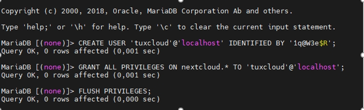
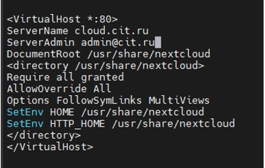
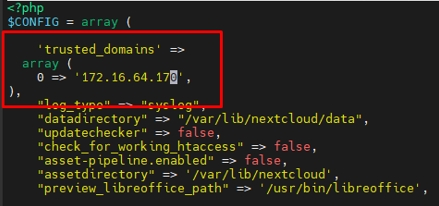
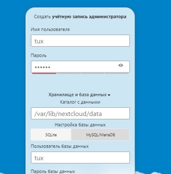
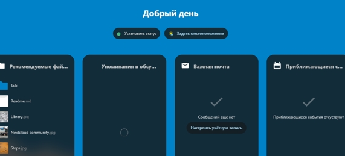
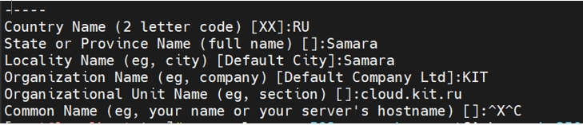
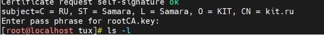

# NextcloudRedOS
***Oблако Nextcloud на системе RedOS***
1. На время установки отключаем SELinux в файле */etc/selinux/config*
Меняем ```SELINUX=enforcing на SELINUX=permissive```
2. устанавливаем необходимые пакеты 
```
dnf install httpd php php-dom php-mbstring php-gd php-pdo php-json php-xml php-zip php-curl php-mcrypt php-pear setroubleshoot-server bzip2 php-ldap php-mysqlnd mariadb mariadb-server mod_auth_kerb php-fpm
```
***Настройка MySQL***

3.Запускаем службу mariadb
```
sudo systemctl start mariadb && systemctl enable mariadb

```
```
sudo mysql_secure_installation
```
Задаем пароль root удаляем анонимных пользователей запрешаем удаленый вход для root, удаляем тестовую базу.
4. Создаем базу и пользователя   
```
mysql -u root –p
```


***Установка Nextcloud***
5. Устанавливаем nectcloud
 ```
dnf install nextcloud nextcloud-httpd nextcloud-mysql
```
6. Создаём виртуальный хост в файле *etc/httpd/conf.d/nextcloud.conf.*
7. Редактируем */usr/share/nextcloud/config/config.php*
 
 
8. В браузере переходим на *http://172.16.64.195/nextcloud*
* Указываем ранее установленные данные и устанавливаем облако

* После окончания установки откроется интерфейс 

9. ***Установка SSL сертификата***
* Добавляем DNS запись в файл hosts  
```
 echo 172.16.64.170 kit.ru > /etc/hosts
```
* Создаем корневой закрытый ключ 
```
openssl genpkey -algorithm RSA -out rootCA.key -aes-128-cbc
```
 * Открытый ключ 
```
openssl req -x509 -new -key rootCA.key -sha256 -days 365 -out rootCA.crt 
```


* Создаем файл kit.ru
* Создаем закрытый ключ
```
 openssl genpkey -algorithm RSA –out kit.ru.key
```
* Запрос на ключ 
```
 openssl req -new -key kit.ru.key -config kit.cnf -reqexts req_ext -out kit.ru.csr
```
* Генерим сертификат 
```
 openssl x509 -req -days 365 -CA rootCA.crt -CAkey rootCA.key -extfile kit.ru.cnf -extensions req_ext -in kit.csr -out kit.ru.crt
```

* Создаем директорию и кладем в нее сертификаты 
```
  mkdir /etc/ssl/private
```
```
cp  rootCA.crt kit.ru.crt  /etc/ssl/certs
```
```
 cp kit.key /etc/ssl/private
```
* Добавляем сертификаты в системное хранилище 
```
 cp  rootCA.crt kit.ru.crt /etc/pki/ca-trust/source/anchors/
```
* Устанавливаем пакет mod_ssl
* Редактируем файл   */etc/httpd/conf/httpd.conf*
*ServerName ckit.ru*    *раскомментировать строку и указать имя сервера*
*LoadModule ssl_module modules/mod_ssl.so*     *добавить строку в конец файла*

